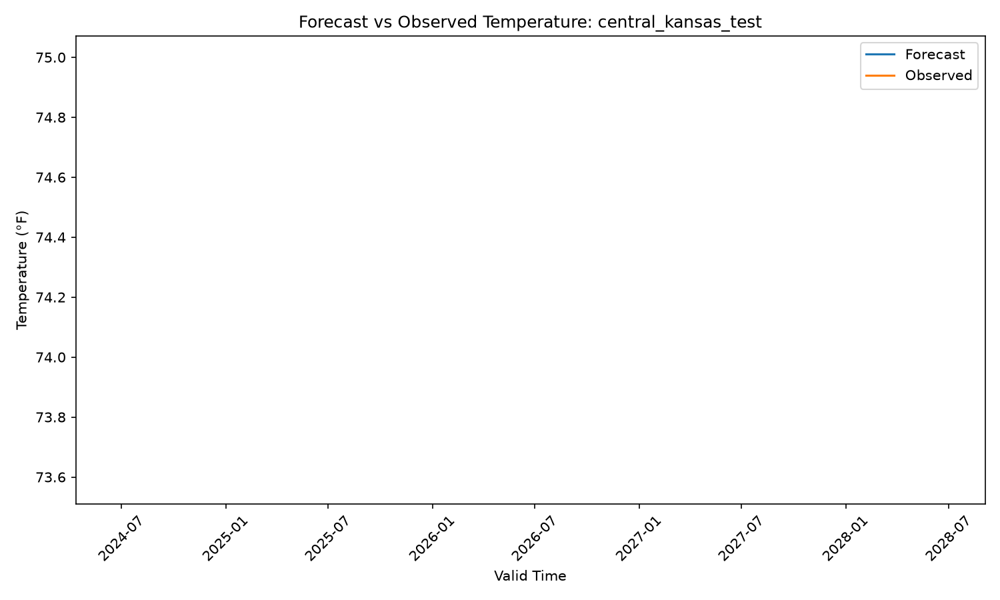

# Forecast Verification Platform

A Python-based data engineering and analytics project that retrieves archived weather forecast data and historical atmospheric observations through external APIs, stores normalized records in a relational database, and evaluates forecast performance using standard forecast verification metrics.

This project was designed to simulate a simplified forecast verification workflow used in atmospheric science and operational forecasting while demonstrating practical software engineering, API integration, SQL database design, data processing, and statistical analysis skills.

---

## Project Overview

Numerical weather prediction models generate forecasts continuously, but evaluating forecast performance requires comparing forecast output against observed atmospheric conditions after the valid time has passed.

This project automates that workflow by retrieving archived forecast data and corresponding historical weather observations, storing the data in a structured relational database, calculating forecast error statistics, and generating analytical visualizations to assess forecast performance.

The overall objective was to build a realistic end-to-end data pipeline that combines software engineering practices with domain-specific scientific analysis.

---

## Example Verification Output

```text
Matched pairs: 360

Bias: 0.80 °F
MAE:  1.94 °F
RMSE: 2.87 °F
```

---

## Tech Stack

### Programming & Data Engineering

- Python
- SQL
- SQLite
- Pandas

### APIs & Data Sources

- Open-Meteo Historical Forecast API
- Open-Meteo Historical Weather Archive API
- REST API Integration

### Visualization & Analysis

- Matplotlib
- Statistical Error Analysis
- Forecast Verification Metrics

### Development Tools

- Git
- GitHub
- Virtual Environments
- Black Code Formatter
- VS Code

---

## Project Architecture

```text
Configured Location Coordinates
              ↓
Open-Meteo Historical Forecast API
              ↓
Open-Meteo Historical Weather Archive API
              ↓
Data Ingestion Pipeline
              ↓
SQLite Database Storage
              ↓
Forecast Verification Engine
              ↓
Statistical Analysis
              ↓
Visualization Generation
```

---

## Project Structure

```text
forecast-verification-platform/

dashboard/
    central_kansas_test_forecast_vs_observed.png
    central_kansas_test_error_timeseries.png
    central_kansas_test_metrics.png

data/
    weather_verification.db

sql/
    schema.sql

src/
    __init__.py
    config.py
    database.py
    load_data.py
    open_meteo_api.py
    plots.py
    verification.py

.gitignore
README.md
locations.csv
requirements.txt
```

---

## Database Design

The project stores normalized forecast and observation data in four relational tables.

### locations

Stores configured forecast verification locations.

| Column      | Description                  |
| ----------- | ---------------------------- |
| location_id | Unique location identifier   |
| name        | Human-readable location name |
| latitude    | Latitude coordinate          |
| longitude   | Longitude coordinate         |
| timezone    | Local timezone               |

### forecasts

Stores archived forecast model output.

| Column        | Description              |
| ------------- | ------------------------ |
| forecast_id   | Unique forecast record   |
| location_id   | Linked location          |
| valid_time    | Forecast valid timestamp |
| temperature_f | Forecast temperature     |
| retrieved_at  | API retrieval timestamp  |

### observations

Stores historical weather observations.

| Column         | Description               |
| -------------- | ------------------------- |
| observation_id | Unique observation record |
| location_id    | Linked location           |
| valid_time     | Observation timestamp     |
| temperature_f  | Observed temperature      |
| retrieved_at   | API retrieval timestamp   |

### verification_results

Stores calculated forecast error values used for statistical verification.

| Column                 | Description                    |
| ---------------------- | ------------------------------ |
| verification_id        | Unique verification record     |
| location_id            | Linked location                |
| valid_time             | Matched verification timestamp |
| forecast_temperature_f | Forecast value                 |
| observed_temperature_f | Observed value                 |
| error_f                | Signed forecast error          |
| absolute_error_f       | Absolute error                 |
| squared_error_f        | Squared error                  |

---

## Verification Methodology

The verification workflow performs time-matched comparisons between archived forecast values and corresponding historical atmospheric conditions.

The pipeline performs the following steps:

1. Retrieve archived hourly forecast temperatures from Open-Meteo Historical Forecast API
2. Retrieve historical hourly weather data from Open-Meteo Historical Weather Archive API
3. Store normalized forecast and observation reports in SQLite database
4. Match forecast and observed values by location and valid timestamp
5. Calculate forecast error for each matched pair
6. Compute aggregate forecast verification metrics
7. Generate visualizations for analysis

---

## Forecast Verification Metrics

The project calculates standard forecast verification metrics commonly used in meteorology and atmospheric science.

### Bias

Measures average forecast overprediction or underprediction.

```text
Bias = Mean(Forecast - Observed)
```

Positive bias indicates systematic overforecasting.

Negative bias indicates systematic underforecasting.

### Mean Absolute Error (MAE)

Measures average forecast error magnitude.

```text
MAE = Mean(|Forecast - Observed|)
```

Lower MAE indicates better forecast performance.

### Root Mean Square Error (RMSE)

Measures forecast error while penalizing larger forecast misses.

```text
RMSE = sqrt(Mean((Forecast - Observed)^2))
```

Lower RMSE indicates better forecast performance.

---

## Example Visualizations

The project generates several analytical outputs for forecast evaluation.

### Forecast vs Observed Temperature Time Series



### Forecast Error Time Series


### Verification Metrics Summary


---

## Example Workflow

## Example Workflow

Run the full end-to-end forecast verification pipeline:

```bash
python -m src.run_pipeline
```

The pipeline automatically performs the following workflow:

1. Initialize SQLite database and create schema
2. Retrieve archived forecast data from Open-Meteo Historical Forecast API
3. Retrieve historical weather observations from Open-Meteo Historical Weather API
4. Store normalized forecast and observation records in the database
5. Match forecast and observed values by valid timestamp
6. Calculate forecast verification metrics (Bias, MAE, RMSE)
7. Save verification results to the database
8. Generate visualization outputs for analysis

To process a single configured location:

```bash
python -m src.run_pipeline --location central_kansas_test
```

---

## Skills Demonstrated

This project demonstrates practical experience in:

- Python software development
- API integration and external data retrieval
- ETL pipeline design
- Relational database design
- SQL data storage and retrieval
- Data cleaning and normalization
- Statistical analysis
- Forecast verification methodology
- Scientific data processing
- Data visualization
- Git version control
- Technical documentation

---

## Future Improvements

Potential future enhancements include:

- Support for multiple forecast models
- Verification of additional atmospheric variables
- Geographic comparison across multiple forecast domains
- Automated recurring data ingestion workflows
- Interactive dashboard development
- Multi-model forecast comparison analysis
- Expanded statistical verification metrics

---

## Motivation

This project was designed to combine atmospheric science domain expertise with modern software engineering practices while building a realistic end-to-end data pipeline similar to workflows used in operational forecasting and meteorological research environments.

The primary goal was to demonstrate practical experience building production-style data systems that combine API integration, data engineering, analytics, and scientific computing.
